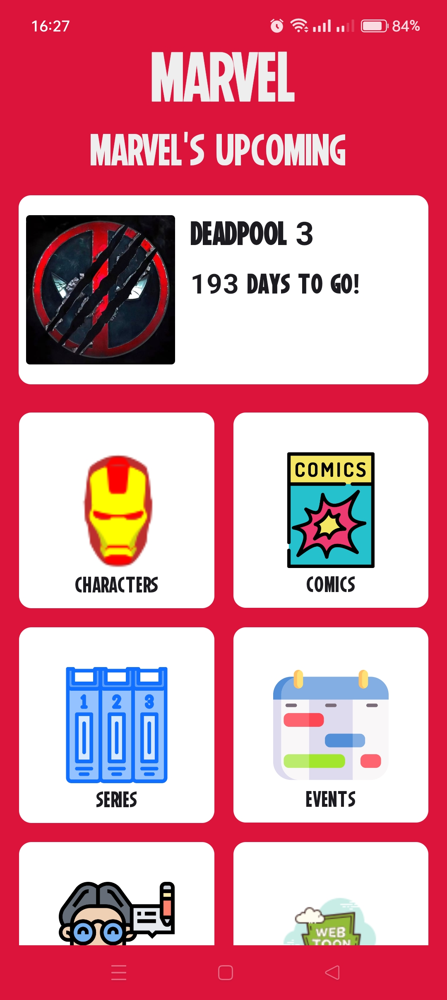
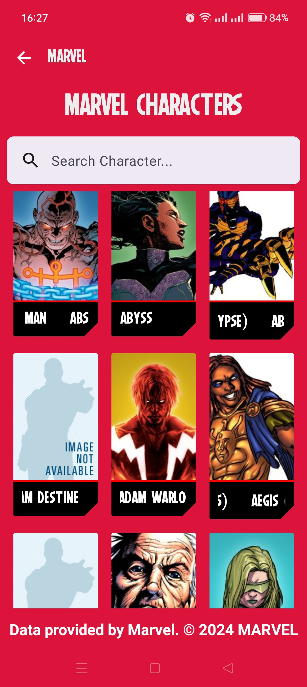
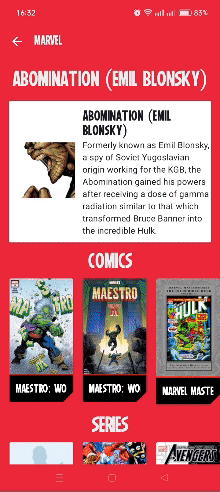
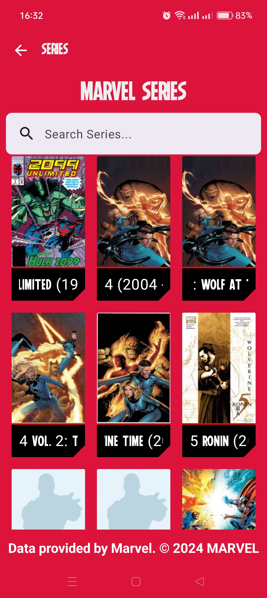

# MCU Nexus App

MCU Nexus App is a Jetpack Compose app that allows users to explore a vast collection of Marvel Comics, characters, and related content. The app fetches data from the Marvel API
## Screenshots

|  *Home Screen*    |  *Characters Screen* |
|:--------------------------------:|:--------------------------------------:|
|  |  |

|  *Character Details Screen*    |  *Series Screen* |
|:--------------------------------:|:--------------------------------------:|
|  |  |


## Features

- Browse a vast collection of Marvel Comics.
- Explore detailed information about Marvel characters.
- Countdown to the next MCU film courtesy of [When is the next MCU film](https://github.com/DiljotSG/MCU-Countdown/blob/develop/docs/API.md)
  
## Technologies Used

- Kotlin
- Jetpack Compose
- MVVM Architecture
- Retrofit (for network calls)
- Coil(for image loading)
- Hilt (for dependency injection)

## Getting Started

To get started with the app:

1. **Get Marvel API Keys:**
    - Visit the [Marvel Developers Portal](https://developer.marvel.com/).
    - Sign in or create a new account.
    - Obtain your public and private API keys.

2. **Add API Keys to Local.Properties File:**
    - Add the following lines to the file, replacing `your_public_key` and `your_private_key` with your actual Marvel API keys.

      ```properties
      PRIVATE_KEY = your_private_key
      PUBLIC_KEY = your_public_key
      ```

3. **Build and Run:**

    - Build and run the app using Android Studio. 

## Design 

App design by [Coding with Evan](https://www.youtube.com/shorts/bagAfxca-nE)

## Contributing

Feel free to contribute to the project by submitting bug reports, feature requests, or pull requests.


---

Happy exploring the Marvel Universe with MCU Nexus!
